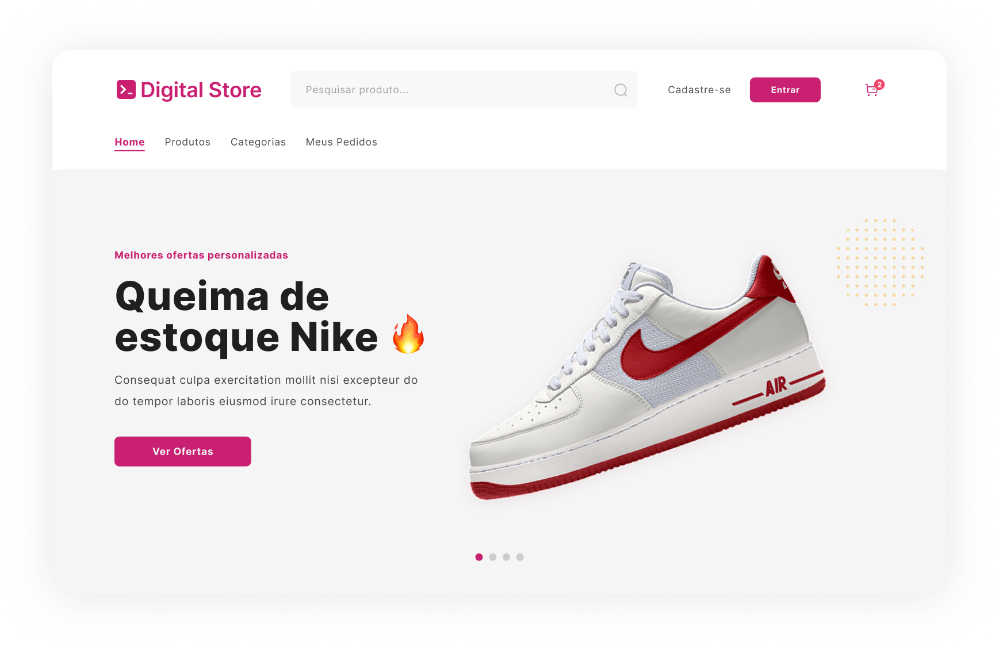

# Digital Store

<div align="center">

[](https://react.dev/)
[](https://www.typescriptlang.org/)
[](https://tailwindcss.com/)
[](https://react-icons.github.io/react-icons/)
[](https://prettier.io/)
[](https://eslint.org/)
[](https://vitejs.dev/)

</div>

## Sobre
Este desafio faz parte da formação **Desenvolvedor Web Full Stack** que é um projeto do Instituto Euvaldo Lodi (IEL) e o Governo do Estado do Ceará por meio da Agência de Desenvolvimento do Estado do Ceará (ADECE) para capacitação de jovens na área da tecnologia.

### Branches

- **main:** Configurada para produção, integrando com os dados reais do back-end.
- **develop:** Configurada com dados simulados (mock) para uma prévia do funcionamento da aplicação.


[]()

## Guia de Instalação

<h4>1. Clonagem do Repositório</h4>

```bash
git clone https://github.com/diogenesolv/Digital-Store.git
```

<h4>2. Instalação de Dependências</h4>

```bash
npm install
```

<h4>4. Execução Local</h4>

```bash
npm run dev
```

## Informações
Para mais detalhes sobre o projeto desenvolvido, consulte os seguintes recursos:

- [Documentação oficial](https://github.com/digitalcollegebr/projeto-digital-store)
- [E-commerce Digital Store](https://digital-store-web.vercel.app/)


## Licença

Este projeto está licenciado sob a [Licença MIT](LICENSE).
